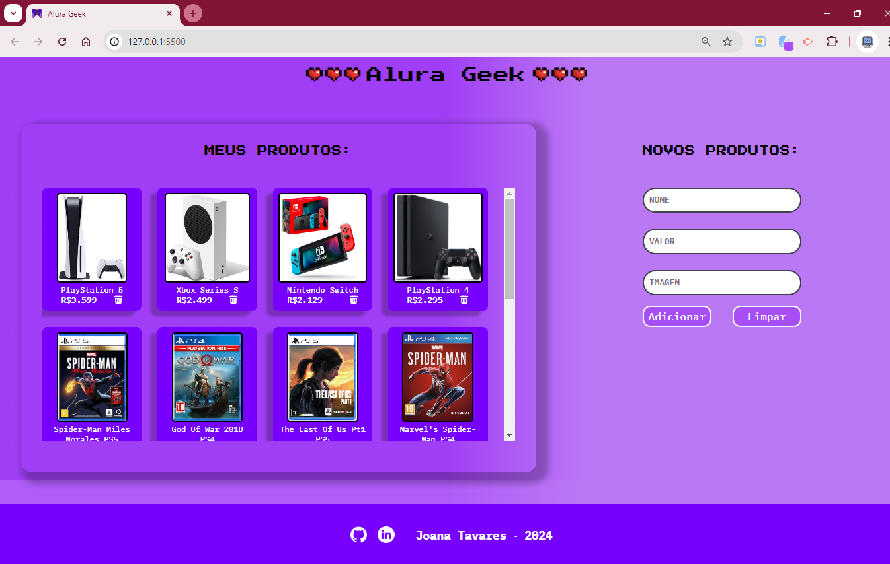

# Challenge Alura Geek

Projeto desenvolvido durante o curso Formação Front End T6 - ONE + Alura

O projeto Alura Geek é um e-commerce com estética gamer. O objetivo desse desafio, é a prática do CRUD, mais especificamente a parte de Create, Read e Delete (Criação, Leitura e Exclusão).

Durante o challenge foram aplicados conceitos como manipulação do DOM, uso dos métodos GET,POST e DELETE. 
Também foi abordado o uso de promises, consumo de APIs, a realização de requisições ao servidor (json-server), programação assíncrona, juntamente com outros conceitos avançados de JavaScript.

Funcionalidades: lista de produtos, adicionar e remover produtos  

Foi um projeto muito desafiador e ainda tenho muitos erros a serem corrigidos, mas fico orgulhosa de ter conseguido concluir mais essa etapa!

 Deploy: https://alura-geek-joanatav.vercel.app//

Figma Original do desafio: https://encurtador.com.br/Kb3l7

<h2>Preview 👀 </h2>

<h2>⚙️Tecnologias Utilizadas</h2>

